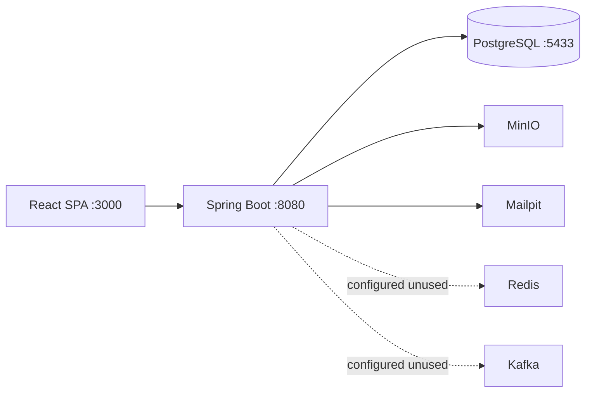

# 02 — Hiện trạng Codebase

> Rà soát: ~181 file Java backend, ~55 file JSX/JS frontend, Flyway V1–V7.  
> Verify: `mvn test` (12 tests), `npm run build` — pass (2026-05-23).

## Tóm tắt điều hành

| Tiêu chí | Điểm /5 | Ghi chú |
|----------|---------|---------|
| MVP M1–M5 | 4.5 | Flow end-to-end demo được |
| Kiến trúc | 4 | Layered rõ; schema rộng hơn code |
| Chất lượng / bảo trì | 3 | Test mỏng, FE file lớn, hardcode URL |
| Bảo mật | 3.5 | JWT/RBAC tốt; media public, secrets default |
| Data / DevOps | 3.5 | ETL mạnh; **bug radical FK**; CI không chạy test |
| Production | 2.5 | M6–8 chưa code; Redis/Kafka unused |

## Kiến trúc runtime

**Backend:** 19 controllers · ~82 endpoints · 25 entities · ~40 services · 6 test classes.

**Frontend:** ~20 routes · 14 axios services · `AuthContext` only (no Redux/React Query).

## Module × Code (truth)

| Module | Backend | Frontend | DB | Ghi chú |
|--------|---------|----------|-----|---------|
| M1 Auth | ✅ | ✅ | ✅ | MVP ổn |
| M2 Course | ✅ | ✅ | ✅ | + AI syllabus BE |
| M3 Learning | ✅ | ✅ | ✅ | Enrollment guard |
| M4 Dictionary | ✅ | ✅ | ✅ | **radical_id seed lỗi** |
| M5 SRS | ✅ | ✅ | ✅ | SM-2 + daily limit |
| M6 Payment | ❌ | ❌ | schema | Không PaymentController |
| M7 Admin | 🟡 | 🟡 | ✅ | User + audit + stats cơ bản |
| M8 Gamification | ❌ | 🟡 UI XP | schema | Không Badge/XP service |

## Điểm mạnh code

### Backend

- Phân lớp: `controller` → `service`/`impl` → `repository` → `entity`.
- `GlobalExceptionHandler`, MapStruct, Flyway `validate`, soft delete `User`.
- `SrsCalculatorService`, `ProgressServiceImpl` (enrollment), `TextSanitizer`.
- `AiSyllabusServiceImpl` fallback; `MediaController` range stream MinIO.
- `@PreAuthorize` admin/teacher; audit async.

### Frontend

- Route guards theo role; axios refresh 401.
- Learning pipeline: `BlockRenderer`, `QuizBlock`, `LearningView`.
- Teacher: `SyllabusManager` (DnD), `CourseForm`.
- Dictionary: `Library`, `PracticeSession`, notebook folders.

## Vấn đề đã xác minh

### P0 — Data

- **Radical FK:** `V2` đổi `radicals.character` sang glyph; `V3` vẫn `WHERE character = '7'` (số) → `radical_id` NULL trên DB sạch.  
  → `docs/DATA_AND_MIGRATION_TASKS.md`

### P0 — Security / config

- `/api/v1/media/**` permit-all.
- `application.yml` có default secrets/API keys.
- JWT filter: token invalid vẫn pass chain (endpoint sau mới chặn).

### P1 — Code smell

- `NotebookService` ~467 dòng (god class).
- `DictionaryService` / `NotebookService` không có interface như các service khác.
- RuntimeException → 500 chung trong auth.

### P1 — Frontend

| File | Dòng | Vấn đề |
|------|------|--------|
| `SyllabusManager.jsx` | ~603 | Monolith |
| `DictionaryDetailPopup.jsx` | ~438 | UI + fetch |
| `LearningView.jsx` | ~412 | Player + progress |
| `SaveToNotebookPopup.jsx` | — | hardcode `localhost:8080` |
| `Login.jsx` | — | hardcode OAuth URL |

### P1 — Test & CI

- 6 tests / ~82 endpoints (~7% surface).
- Không controller test, không auth integration test.
- CI: `mvn package` only, không `mvn test`.

### Schema ≠ Java (V1 tables, no entity)

`payments`, `notifications`, `badges`, `user_badges`, `xp_transactions`, `comments`, `mock_exams`, `articles`, …

### Infra “ảo”

`Kafka`, `Redis`, `AMQP`, `WebSocket` trong pom/yml — **0 usage** trong `src/main/java`.

## Top 10 việc code (ROI)

1. Sửa radical FK (V8 hoặc ETL).
2. CI chạy `mvn test`.
3. Gỡ hoặc dùng Redis/Kafka.
4. Tách + test `NotebookService`.
5. FE: `api.js` everywhere, fix OAuth.
6. Bảo vệ `/media/**`.
7. Secrets → env only.
8. `@WebMvcTest` auth/progress/notebook.
9. Chốt M6 scope trước khi code.
10. Tách `SyllabusManager` / `Dashboard`.

Backlog chi tiết: [05-BACKLOG-UU-TIEN.md](./05-BACKLOG-UU-TIEN.md).
