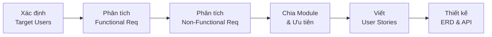
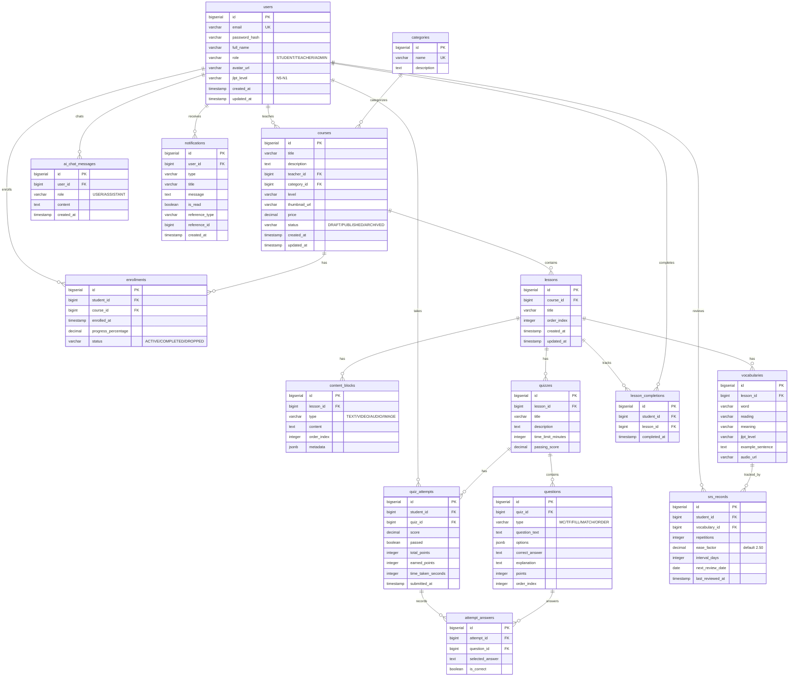
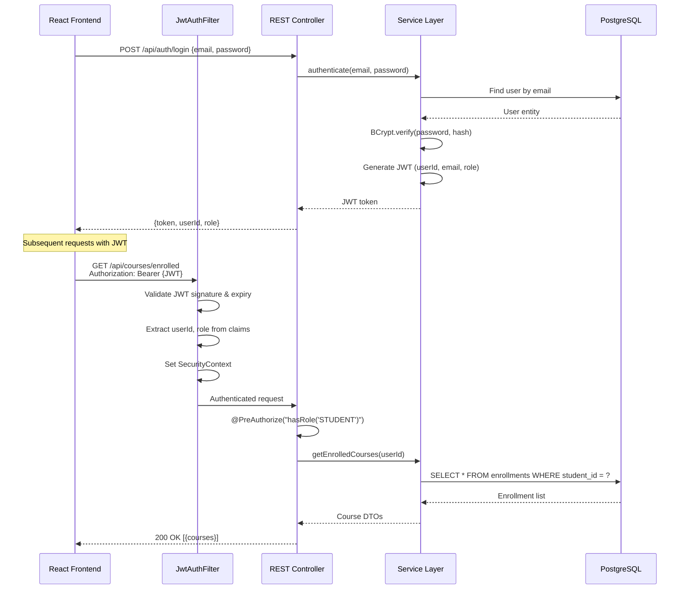
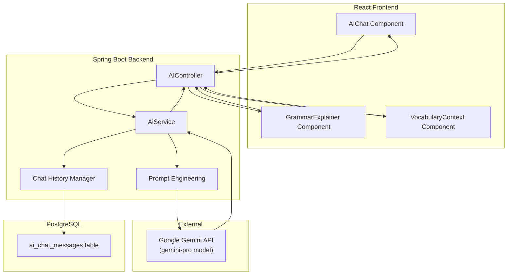
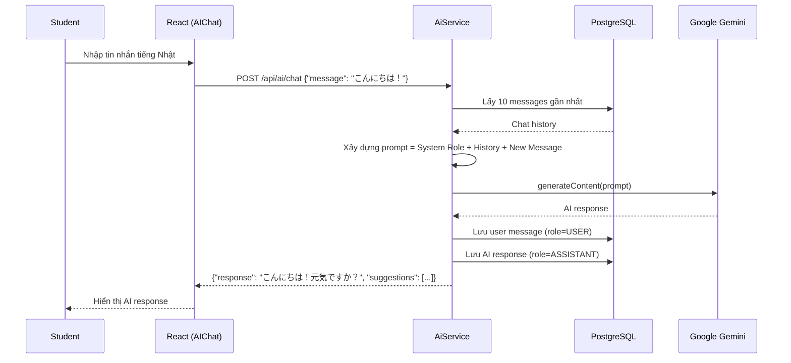

# 🌸 SakuraLearn — Tài Liệu Chuẩn Bị Phỏng Vấn Intern BrSE Tech

> **Vị trí:** Intern BrSE Tech  
> **Ngày phỏng vấn:** 2026-06-03  
> **Project:** SakuraLearn — Nền tảng EdTech học tiếng Nhật  

---

## 📋 Mục Lục

1. [Tổng Quan Project](#1-tổng-quan-project)
2. [Requirement Analysis (Phân Tích Yêu Cầu)](#2-requirement-analysis)
3. [User Stories (Câu Chuyện Người Dùng)](#3-user-stories)
4. [ERD — Entity Relationship Diagram](#4-erd--entity-relationship-diagram)
5. [API Design (Thiết Kế API)](#5-api-design)
6. [AI Integration (Tích Hợp AI)](#6-ai-integration)
7. [Gợi Ý Câu Hỏi Phỏng Vấn & Cách Trả Lời](#7-gợi-ý-câu-hỏi-phỏng-vấn--cách-trả-lời)

---

## 1. Tổng Quan Project

### 🎯 SakuraLearn là gì?

SakuraLearn là **nền tảng học tiếng Nhật trực tuyến** kết hợp:
- Học theo **khóa học có cấu trúc** (course-based learning)
- **AI tutoring** thông minh (Google Gemini)
- Ôn tập từ vựng bằng **thuật toán SRS** (Spaced Repetition System)
- Hệ thống **quiz đa dạng** với chấm điểm tự động
- **Gamification** (điểm thưởng, huy hiệu, bảng xếp hạng)

### 🛠 Tech Stack

| Layer | Technology |
|-------|-----------|
| **Frontend** | React 18 + Vite |
| **Backend** | Java 17 + Spring Boot 3.2 |
| **Database** | PostgreSQL 16 |
| **AI** | Google Gemini API (gemini-pro) |
| **Auth** | JWT (JSON Web Token) |
| **Migration** | Flyway |
| **Deploy** | Docker + Docker Compose |

### 👥 3 Roles Chính

| Role | Mô tả |
|------|--------|
| **STUDENT** | Học viên — đăng ký khóa học, học bài, làm quiz, ôn từ vựng, chat AI |
| **TEACHER** | Giảng viên — tạo/quản lý khóa học, bài học, từ vựng, quiz |
| **ADMIN** | Quản trị viên — quản lý user, khóa học toàn hệ thống |

### 📦 9 Modules

| Module | Tên | Trạng thái |
|--------|-----|-----------|
| M1 | User Management | ✅ Implemented |
| M2 | Course Management | ✅ Implemented |
| M3 | Lesson & Content | ✅ Implemented |
| M4 | Vocabulary & SRS | ✅ Implemented |
| M5 | Quiz & Assessment | ✅ Implemented |
| M6 | Payment & Subscription | 📋 DB Schema Only |
| M7 | AI-Powered Features | ✅ Implemented |
| M8 | Gamification | 📋 DB Schema Only |
| M9 | Notification | ✅ Implemented |

> [!IMPORTANT]
> **Module 6 (Payment)** và **Module 8 (Gamification)** chỉ có database schema, chưa implement code Java/React. Khi được hỏi, nên nói rõ: *"Chúng tôi đã thiết kế schema trước để đảm bảo data model sẵn sàng cho phase tiếp theo."*

---

## 2. Requirement Analysis

### 2.1 Quy Trình Phân Tích Yêu Cầu



### 2.2 Target Users Analysis

| User Type | Đặc điểm | Nhu cầu chính |
|-----------|----------|---------------|
| **Học viên (Student)** | Người học tiếng Nhật từ N5→N1, đa dạng trình độ | Học theo cấu trúc, ôn tập thông minh, luyện nói với AI |
| **Giảng viên (Teacher)** | Giáo viên tiếng Nhật muốn dạy online | Tạo nội dung đa phương tiện, quản lý quiz, theo dõi học viên |
| **Quản trị viên (Admin)** | Người quản lý nền tảng | Quản lý user, quản lý nội dung, giám sát hệ thống |

### 2.3 Functional Requirements (FR) theo Module

#### Module 1 — User Management
| FR ID | Yêu cầu | Mức ưu tiên |
|-------|---------|-------------|
| FR-1.1 | Đăng ký tài khoản với email/password, chọn role (Student/Teacher) | P0 |
| FR-1.2 | Đăng nhập, nhận JWT token | P0 |
| FR-1.3 | Xem và cập nhật profile (avatar, tên, JLPT level) | P0 |
| FR-1.4 | Admin quản lý danh sách user, thay đổi role | P0 |

#### Module 2 — Course Management
| FR ID | Yêu cầu | Mức ưu tiên |
|-------|---------|-------------|
| FR-2.1 | Teacher tạo khóa học (title, description, category, level, thumbnail) | P0 |
| FR-2.2 | Student tìm kiếm/lọc khóa học (theo keyword, category, JLPT level) | P0 |
| FR-2.3 | Student đăng ký (enroll) khóa học, theo dõi tiến độ | P0 |
| FR-2.4 | Teacher chỉnh sửa/xóa khóa học của mình | P0 |
| FR-2.5 | Admin quản lý tất cả khóa học | P0 |

#### Module 3 — Lesson & Content
| FR ID | Yêu cầu | Mức ưu tiên |
|-------|---------|-------------|
| FR-3.1 | Teacher tạo bài học với content blocks (text, video, audio, image) | P0 |
| FR-3.2 | Student xem nội dung bài học (render đa phương tiện) | P0 |
| FR-3.3 | Hệ thống tracking lesson completion, cập nhật tiến độ khóa học | P0 |

#### Module 4 — Vocabulary & SRS
| FR ID | Yêu cầu | Mức ưu tiên |
|-------|---------|-------------|
| FR-4.1 | Teacher thêm từ vựng vào bài học (word, reading, meaning, JLPT, example) | P0 |
| FR-4.2 | Student ôn tập từ vựng qua flashcard | P0 |
| FR-4.3 | Thuật toán SRS (SM-2) lên lịch ôn tập dựa trên hiệu suất | P0 |

#### Module 5 — Quiz & Assessment
| FR ID | Yêu cầu | Mức ưu tiên |
|-------|---------|-------------|
| FR-5.1 | Teacher tạo quiz với nhiều loại câu hỏi (MC, T/F, fill-in, matching, ordering) | P0 |
| FR-5.2 | Student làm quiz, hệ thống chấm điểm tự động, hiển thị kết quả | P0 |
| FR-5.3 | Student xem lịch sử các lần làm quiz | P0 |

#### Module 7 — AI Features
| FR ID | Yêu cầu | Mức ưu tiên |
|-------|---------|-------------|
| FR-7.1 | AI giải thích ngữ pháp theo ngữ cảnh và trình độ người học | P0 |
| FR-7.2 | AI tạo câu ví dụ và ngữ cảnh cho từ vựng | P0 |
| FR-7.3 | AI conversation practice (luyện hội thoại qua chat) | P0 |

#### Module 9 — Notification
| FR ID | Yêu cầu | Mức ưu tiên |
|-------|---------|-------------|
| FR-9.1 | Gửi notification in-app khi enroll, hoàn thành quiz, đạt thành tích | P0 |

### 2.4 Non-Functional Requirements (NFR)

| NFR ID | Yêu cầu | Giải pháp |
|--------|---------|----------|
| NFR-1 | **Bảo mật** — Xác thực an toàn, phân quyền rõ ràng | JWT + Spring Security + BCrypt password hashing |
| NFR-2 | **Hiệu năng** — API response < 500ms | PostgreSQL indexing, JPA fetch strategy (LAZY loading) |
| NFR-3 | **Khả năng mở rộng** — Dễ thêm module mới | Kiến trúc modular, Flyway migration (forward-only) |
| NFR-4 | **Khả dụng** — Hỗ trợ containerization | Docker + Docker Compose |
| NFR-5 | **Đa nội dung** — Hỗ trợ text, video, audio, image | JSONB metadata cho content blocks |
| NFR-6 | **AI Cost Control** — Giới hạn chi phí API AI | maxOutputTokens: 2048, history limit: 10 messages |

### 2.5 💡 Cách Nói Khi Phỏng Vấn

> **Q: "Em đã phân tích yêu cầu như thế nào?"**
>
> "Đầu tiên em xác định **3 đối tượng người dùng chính** (Student, Teacher, Admin), sau đó phân tích **nhu cầu cụ thể** của từng đối tượng. Từ đó em chia hệ thống thành **9 module** và đánh mức ưu tiên P0/P1. Phase 1 tập trung vào 7 module core (M1-M5, M7, M9), còn M6 (Payment) và M8 (Gamification) em thiết kế DB schema trước nhưng chưa implement code — để đảm bảo **data model đã sẵn sàng** cho phase tiếp theo mà không cần migration phức tạp."

> **Tiếng Nhật:**
> 「まず、3つのユーザータイプ（学生、教師、管理者）を特定し、それぞれのニーズを分析しました。次に、システムを9つのモジュールに分割し、優先度（P0/P1）を設定しました。Phase 1ではコアの7モジュールに集中し、PaymentとGamificationはDBスキーマのみを先に設計しました。」

---

## 3. User Stories

### 3.1 Format

```
As a [role], I want to [action], so that [benefit].
```

### 3.2 User Stories Theo Role

#### 🎓 Student Stories

| ID | User Story | Acceptance Criteria |
|----|-----------|-------------------|
| US-1.1 | As a **Student**, I want to **register with email/password** so that I can access the platform. | ✅ Email unique validation ✅ Password hashing ✅ Role = STUDENT |
| US-1.2 | As a **Student**, I want to **login** so that I receive a JWT token for authentication. | ✅ Return JWT + user info ✅ Token expires in 24h |
| US-1.3 | As a **Student**, I want to **update my profile** so that I can set my avatar and JLPT level. | ✅ Update full_name, avatar_url, jlpt_level |
| US-2.2 | As a **Student**, I want to **browse and search courses** so that I can find relevant content. | ✅ Search by keyword ✅ Filter by category, JLPT level ✅ Pagination |
| US-2.3 | As a **Student**, I want to **enroll in a course** so that I can access its content and track progress. | ✅ Create enrollment record ✅ Track progress % ✅ Prevent duplicate enrollment |
| US-3.2 | As a **Student**, I want to **view lesson content** so that I can learn with text, video, audio, and images. | ✅ Render mixed content types ✅ Ordered content blocks |
| US-3.3 | As a **Student**, I want the system to **track my lesson completion** so that my course progress updates automatically. | ✅ Mark lesson complete ✅ Recalculate course progress % |
| US-4.2 | As a **Student**, I want to **review vocabulary with flashcards** so that I can memorize words effectively. | ✅ Flashcard flip animation ✅ Show word → reading → meaning |
| US-4.3 | As a **Student**, I want the **SRS algorithm to schedule reviews** so that I review at optimal intervals. | ✅ SM-2 algorithm ✅ Quality rating 1-5 ✅ Auto-calculate next review date |
| US-5.2 | As a **Student**, I want to **take quizzes and get auto-graded** so that I can test my knowledge. | ✅ 5 question types ✅ Auto-grading ✅ Show score + explanations |
| US-7.1 | As a **Student**, I want **AI to explain grammar** so that I understand grammar in context. | ✅ Level-appropriate explanation ✅ Example sentences ✅ Common mistakes |
| US-7.3 | As a **Student**, I want to **practice conversation with AI** so that I can improve my speaking/writing. | ✅ Chat interface ✅ Context-aware responses ✅ Gentle error correction |

#### 👨‍🏫 Teacher Stories

| ID | User Story | Acceptance Criteria |
|----|-----------|-------------------|
| US-2.1 | As a **Teacher**, I want to **create courses** so that I can share my teaching content. | ✅ Set title, description, category, level, thumbnail ✅ Course status: DRAFT/PUBLISHED |
| US-2.4 | As a **Teacher**, I want to **edit/delete my courses** so that I can manage my content. | ✅ Only owner can edit/delete ✅ Cascade delete lessons |
| US-3.1 | As a **Teacher**, I want to **add lessons with mixed content** so that I can create rich learning materials. | ✅ Content blocks: TEXT/VIDEO/AUDIO/IMAGE ✅ Order management |
| US-4.1 | As a **Teacher**, I want to **add vocabulary to lessons** so that students can learn new words. | ✅ Word, reading, meaning, JLPT level, example sentence |
| US-5.1 | As a **Teacher**, I want to **create quizzes with multiple question types** so that I can assess students. | ✅ MC, T/F, fill-in-blank, matching, ordering ✅ Set passing score, time limit |

#### 🔧 Admin Stories

| ID | User Story | Acceptance Criteria |
|----|-----------|-------------------|
| US-1.4 | As an **Admin**, I want to **manage all users** so that I can maintain platform integrity. | ✅ List users (paginated) ✅ Change user roles |
| US-2.5 | As an **Admin**, I want to **manage all courses** so that I can moderate content quality. | ✅ View/delete any course |

### 3.3 💡 Cách Nói Khi Phỏng Vấn

> **Q: "Em viết User Story như thế nào?"**
>
> "Em sử dụng format chuẩn: **As a [role], I want to [action], so that [benefit]**. Mỗi user story đều có **Acceptance Criteria** rõ ràng để dev team biết khi nào feature đã hoàn thành. Ví dụ cho tính năng SRS: *'As a Student, I want the SRS algorithm to schedule reviews so that I review vocabulary at optimal intervals'* — với acceptance criteria bao gồm: sử dụng thuật toán SM-2, quality rating 1-5, và tự động tính ngày ôn tập tiếp theo."

> **Tiếng Nhật:**
> 「ユーザーストーリーは『As a [role], I want to [action], so that [benefit]』の形式で書きました。各ストーリーには明確な受け入れ基準を設定し、開発チームが完了条件を理解できるようにしました。」

---

## 4. ERD — Entity Relationship Diagram

### 4.1 Tổng Quan Database

- **Tổng số bảng:** 20 tables
- **14 bảng** có full implementation (Java Entity + React UI)
- **6 bảng** chỉ có DB schema (Payment: 2 bảng, Gamification: 4 bảng)
- **Database:** PostgreSQL 16
- **Migration:** Flyway (7 migrations: V1 → V7, forward-only)

### 4.2 ERD Diagram



### 4.3 Các Quan Hệ Chính

| Quan hệ | Loại | Giải thích |
|---------|------|-----------|
| users → courses | 1:N | Một Teacher tạo nhiều khóa học |
| users ↔ courses (via enrollments) | N:M | Nhiều Student enroll nhiều khóa học |
| courses → lessons | 1:N | Một khóa học có nhiều bài học (CASCADE DELETE) |
| lessons → content_blocks | 1:N | Một bài học có nhiều content blocks (CASCADE DELETE) |
| lessons → vocabularies | 1:N | Một bài học có nhiều từ vựng |
| lessons → quizzes | 1:N | Một bài học có nhiều quiz |
| quizzes → questions | 1:N | Một quiz có nhiều câu hỏi (CASCADE DELETE) |
| users + vocabularies → srs_records | Ternary | Mỗi student có SRS record riêng cho từng từ vựng |
| users + quizzes → quiz_attempts | Ternary | Mỗi student có nhiều lần làm quiz |

### 4.4 Quyết Định Thiết Kế Quan Trọng

| Quyết định | Lý do |
|-----------|-------|
| **JSONB** cho `content_blocks.metadata` và `questions.options` | Cho phép schema linh hoạt cho các loại content/question khác nhau |
| **CASCADE DELETE** từ courses → lessons → content | Khi xóa course, tự động xóa toàn bộ nội dung liên quan |
| **UNIQUE constraint** trên `(student_id, vocabulary_id)` trong srs_records | Đảm bảo mỗi student chỉ có 1 SRS record per từ vựng |
| **Enum as VARCHAR** (không dùng PostgreSQL ENUM) | Dễ dàng thêm giá trị mới mà không cần migration |
| **Forward-only migration** (không sửa V1-V7) | Best practice cho Flyway, đảm bảo consistency |

### 4.5 💡 Cách Nói Khi Phỏng Vấn

> **Q: "Em thiết kế database như thế nào?"**
>
> "Em sử dụng **PostgreSQL** với **Flyway** để quản lý migration. Database có tổng **20 bảng**, chia theo 9 module. Một điểm đặc biệt là em sử dụng **JSONB** cho `content_blocks.metadata` và `questions.options` — vì mỗi loại content (TEXT, VIDEO, AUDIO) và mỗi loại question (MC, T/F, fill-in) cần metadata khác nhau, JSONB cho phép **schema linh hoạt** mà không cần tạo nhiều bảng con. Ngoài ra, em thiết kế **CASCADE DELETE** để đảm bảo data integrity — khi xóa course sẽ tự động xóa lessons, content blocks, vocabularies."

> **Tiếng Nhật:**
> 「データベースはPostgreSQLを使用し、Flywayでマイグレーションを管理しています。合計20テーブルで、9モジュールに分かれています。特徴的なのは、content_blocksのmetadataにJSONBを使用したことです。テキスト、ビデオ、オーディオなど異なるコンテンツタイプに柔軟に対応できます。また、CASCADE DELETEでデータ整合性を保証しています。」

---

## 5. API Design

### 5.1 Nguyên Tắc Thiết Kế

| Nguyên tắc | Áp dụng |
|-----------|---------|
| **RESTful** | Resource-based URLs: `/api/courses`, `/api/courses/{id}` |
| **HTTP Methods** | GET (read), POST (create), PUT (update), DELETE (delete) |
| **JWT Authentication** | Bearer token trong Authorization header |
| **RBAC** | `@PreAuthorize` annotation trên controller |
| **Pagination** | Query params: `page`, `size`, `sort` |
| **Consistent Error Format** | `{ "status": 400, "error": "Bad Request", "message": "..." }` |
| **Nested Resources** | `/api/courses/{courseId}/lessons/{lessonId}/vocabulary` |

### 5.2 Tổng Quan Endpoints (40+ endpoints)

#### 🔐 Authentication (`/api/auth`)

```
POST /api/auth/register     → Đăng ký (Public)
POST /api/auth/login        → Đăng nhập, nhận JWT (Public)
```

**Register Request/Response:**
```json
// Request
{ "email": "student@example.com", "password": "Pass123!", "fullName": "Nguyen Van A", "role": "STUDENT" }

// Response (Login)
{ "token": "eyJhbG...", "userId": 1, "email": "student@example.com", "fullName": "Nguyen Van A", "role": "STUDENT" }
```

---

#### 👤 Users (`/api/users`)

```
GET    /api/users/me          → Xem profile (Authenticated)
PUT    /api/users/me          → Cập nhật profile (Authenticated)
GET    /api/users             → Danh sách users (ADMIN)
PUT    /api/users/{id}/role   → Đổi role user (ADMIN)
```

---

#### 📚 Courses (`/api/courses`)

```
GET    /api/courses                → Tìm kiếm/lọc khóa học (Public)
GET    /api/courses/{id}           → Chi tiết khóa học (Public)
POST   /api/courses                → Tạo khóa học (TEACHER)
PUT    /api/courses/{id}           → Sửa khóa học (TEACHER - owner)
DELETE /api/courses/{id}           → Xóa khóa học (TEACHER - owner / ADMIN)
POST   /api/courses/{id}/enroll    → Đăng ký khóa học (STUDENT)
GET    /api/courses/enrolled       → Khóa học đã đăng ký (STUDENT)
GET    /api/courses/{id}/progress  → Tiến độ học (STUDENT - enrolled)
```

**Search/Filter Query Params:**
- `keyword` — tìm trong title/description
- `categoryId` — lọc theo category
- `level` — lọc theo JLPT (N5, N4, N3, N2, N1)
- `page`, `size`, `sort` — phân trang

---

#### 📖 Lessons (`/api/courses/{courseId}/lessons`)

```
GET    .../lessons                          → Danh sách bài học (Enrolled/Owner)
GET    .../lessons/{lessonId}               → Chi tiết bài học + content (Enrolled/Owner)
POST   .../lessons                          → Tạo bài học (TEACHER - owner)
PUT    .../lessons/{lessonId}               → Sửa bài học (TEACHER - owner)
DELETE .../lessons/{lessonId}               → Xóa bài học (TEACHER - owner)
POST   .../lessons/{lessonId}/complete      → Đánh dấu hoàn thành (STUDENT - enrolled)
```

**Lesson với Content Blocks:**
```json
{
  "title": "Bài 1: Hiragana cơ bản",
  "orderIndex": 1,
  "contentBlocks": [
    { "type": "TEXT", "content": "# Giới thiệu Hiragana\nHiragana là...", "orderIndex": 1 },
    { "type": "VIDEO", "content": "https://youtube.com/watch?v=...", "orderIndex": 2 },
    { "type": "IMAGE", "content": "https://storage/hiragana-chart.png", "orderIndex": 3 },
    { "type": "AUDIO", "content": "https://storage/pronunciation.mp3", "orderIndex": 4 }
  ]
}
```

---

#### 📝 Vocabulary (`/api/courses/{courseId}/lessons/{lessonId}/vocabulary`)

```
GET    .../vocabulary              → Danh sách từ vựng (Authenticated)
GET    .../vocabulary/{vocabId}    → Chi tiết từ vựng (Authenticated)
POST   .../vocabulary              → Thêm từ vựng (TEACHER - owner)
PUT    .../vocabulary/{vocabId}    → Sửa từ vựng (TEACHER - owner)
DELETE .../vocabulary/{vocabId}    → Xóa từ vựng (TEACHER - owner)

GET    /api/vocabulary/review              → Từ vựng cần ôn tập SRS (STUDENT)
POST   /api/vocabulary/{vocabId}/review    → Submit kết quả ôn tập (STUDENT)
```

**SRS Review:**
```json
// Request
{ "quality": 4 }    // 1 (quên hoàn toàn) → 5 (nhớ hoàn hảo)

// Response
{ "nextReviewDate": "2026-06-08", "intervalDays": 6, "easeFactor": 2.6 }
```

---

#### 🧪 Quiz (`/api/courses/{courseId}/lessons/{lessonId}/quizzes`)

```
GET    .../quizzes                      → Danh sách quiz (Authenticated)
GET    .../quizzes/{quizId}             → Chi tiết quiz + câu hỏi (Authenticated)
POST   .../quizzes                      → Tạo quiz (TEACHER - owner)
PUT    .../quizzes/{quizId}             → Sửa quiz (TEACHER - owner)
DELETE .../quizzes/{quizId}             → Xóa quiz (TEACHER - owner)
POST   .../quizzes/{quizId}/submit      → Nộp bài (STUDENT - enrolled)
GET    .../quizzes/{quizId}/attempts    → Lịch sử làm quiz (STUDENT)
```

**5 Loại Câu Hỏi:**
```
MULTIPLE_CHOICE  → Chọn 1 đáp án đúng
TRUE_FALSE       → Đúng/Sai
FILL_IN_BLANK    → Điền vào chỗ trống
MATCHING         → Nối cặp
ORDERING         → Sắp xếp thứ tự
```

---

#### 🤖 AI Features (`/api/ai`)

```
POST   /api/ai/grammar/explain      → AI giải thích ngữ pháp (Authenticated)
POST   /api/ai/vocabulary/context    → AI tạo ngữ cảnh từ vựng (Authenticated)
POST   /api/ai/chat                  → AI luyện hội thoại (Authenticated)
GET    /api/ai/chat/history          → Lịch sử chat AI (Authenticated)
```

---

#### 🔔 Notifications (`/api/notifications`)

```
GET    /api/notifications              → Danh sách thông báo (Authenticated)
GET    /api/notifications/unread-count  → Số thông báo chưa đọc (Authenticated)
PUT    /api/notifications/{id}/read     → Đánh dấu đã đọc (Authenticated)
PUT    /api/notifications/read-all      → Đánh dấu tất cả đã đọc (Authenticated)
```

### 5.3 Security Flow



### 5.4 💡 Cách Nói Khi Phỏng Vấn

> **Q: "Em thiết kế API như thế nào?"**
>
> "Em theo nguyên tắc **RESTful** với resource-based URL. Hệ thống có hơn **40 endpoints** được tổ chức theo module. Em sử dụng **nested resources** cho quan hệ cha-con — ví dụ `/api/courses/{courseId}/lessons/{lessonId}/vocabulary` — giúp URL tự mô tả hierarchy rõ ràng. Về security, em dùng **JWT + Spring Security** với **3 tầng bảo vệ**: (1) JwtAuthFilter validate token ở mỗi request, (2) `@PreAuthorize` annotation kiểm tra role, (3) Business logic kiểm tra ownership — ví dụ chỉ Teacher tạo course mới có quyền sửa/xóa course đó."

> **Tiếng Nhật:**
> 「RESTful原則に従い、リソースベースのURLを設計しました。40以上のエンドポイントがモジュール別に整理されています。ネストされたリソース構造（例：/api/courses/{id}/lessons/{id}/vocabulary）により、階層関係が明確です。セキュリティはJWT + Spring Securityで3層の保護を実装しています。」

---

## 6. AI Integration

### 6.1 Tổng Quan

| Feature | Mô tả | Input | Output |
|---------|--------|-------|--------|
| **Grammar Explanation** | Giải thích ngữ pháp theo trình độ | Grammar point + context + JLPT level | Giải thích + rules + examples + mistakes |
| **Vocabulary Context** | Tạo ngữ cảnh cho từ vựng | Word + reading + meaning + JLPT level | 5 ví dụ + từ liên quan + notes + collocations |
| **Conversation Practice** | Luyện hội thoại với AI tutor | User message + chat history | AI response (mixed JP/EN) |

### 6.2 Kiến Trúc AI



### 6.3 Prompt Engineering Chi Tiết

#### Feature 1: Grammar Explanation

```
System Role: "You are a Japanese language teacher."

Prompt Template:
"Explain the grammar point '{grammarPoint}' for a student at {userLevel} level.
[If context provided]: 'The grammar is used in this sentence: {context}'

Provide:
1) Explanation in simple terms
2) Formation/conjugation rules  
3) 3 example sentences with translations
4) Common mistakes to avoid"
```

**Ví dụ thực tế:**
```json
// Request
{
  "grammarPoint": "〜ている",
  "context": "日本語を勉強しています",
  "userLevel": "N5"
}

// AI Response (structured)
{
  "grammarPoint": "〜ている",
  "explanation": "〜ている biểu thị hành động đang diễn ra hoặc trạng thái kết quả...",
  "formationRules": "Verb て-form + いる → ている (nói thường) / ています (lịch sự)",
  "examples": [
    "今、ご飯を食べています。(Tôi đang ăn cơm.)",
    "東京に住んでいます。(Tôi đang sống ở Tokyo.)",
    "窓が開いています。(Cửa sổ đang mở.)"
  ],
  "commonMistakes": "Chú ý: 'kết hôn' dùng 結婚している (trạng thái), không dùng 結婚する"
}
```

#### Feature 2: Vocabulary Context

```
System Role: "You are a Japanese language teacher."

Prompt Template:
"For the vocabulary word '{word}' ({reading}), meaning '{meaning}', 
at JLPT {jlptLevel} level:

Provide:
1) 5 example sentences showing different usage patterns
2) Related words and synonyms
3) Usage notes and nuances
4) Common collocations"
```

#### Feature 3: Conversation Practice

```
System Role:
"You are a friendly Japanese language tutor. 
Practice conversation with the student.
Adjust your language level to {userLevel}. 
Mix Japanese and English in responses.
Correct mistakes gently. 
Introduce new vocabulary naturally.
Keep responses conversational and encouraging."

→ Gửi kèm 10 messages gần nhất từ chat history để duy trì ngữ cảnh.
```

### 6.4 Technical Implementation

```java
// Cách gọi Gemini API
private String callGeminiApi(String prompt) {
    String url = apiBaseUrl + "/models/" + modelName + ":generateContent?key=" + apiKey;
    
    Map<String, Object> requestBody = Map.of(
        "contents", List.of(Map.of("parts", List.of(Map.of("text", prompt)))),
        "generationConfig", Map.of(
            "temperature", 0.7,      // Cân bằng giữa sáng tạo và chính xác
            "topK", 40,              // Giới hạn token sampling
            "topP", 0.95,            // Nucleus sampling
            "maxOutputTokens", 2048  // Giới hạn chi phí
        )
    );
    
    ResponseEntity<Map> response = geminiRestTemplate.postForEntity(url, requestBody, Map.class);
    return extractGeneratedText(response.getBody());
}
```

### 6.5 Chat History Management



### 6.6 Chiến Lược Kiểm Soát Chi Phí AI

| Chiến lược | Cách làm |
|-----------|---------|
| **Token limit** | `maxOutputTokens: 2048` — giới hạn output mỗi request |
| **History limit** | Chỉ gửi **10 messages gần nhất** — tránh prompt quá dài |
| **Temperature** | `0.7` — cân bằng giữa creativity và accuracy |
| **Caching** (planned) | Cache grammar explanations cho các grammar point phổ biến |
| **Rate limiting** (planned) | Giới hạn số request AI per user per thời gian |

### 6.7 💡 Cách Nói Khi Phỏng Vấn

> **Q: "Em tích hợp AI như thế nào?"**
>
> "Em tích hợp **Google Gemini API** (model gemini-pro) cho 3 tính năng chính: **(1) Grammar Explanation** — AI giải thích ngữ pháp tùy theo trình độ JLPT của người học, kèm ví dụ và lỗi thường gặp. **(2) Vocabulary Context** — AI tạo câu ví dụ và từ liên quan cho từ vựng. **(3) Conversation Practice** — người học chat trực tiếp với AI tutor, hệ thống lưu **10 messages gần nhất** để duy trì ngữ cảnh hội thoại.
>
> Về **Prompt Engineering**, em thiết kế system role cụ thể cho từng feature — ví dụ conversation practice có instruction để AI *'sửa lỗi nhẹ nhàng, giới thiệu từ vựng mới tự nhiên, mix Japanese và English'*. Về **cost control**, em giới hạn `maxOutputTokens: 2048` và chỉ gửi 10 messages gần nhất để tránh prompt quá dài."

> **Tiếng Nhật:**
> 「Google Gemini API（gemini-proモデル）を3つの機能に統合しました：(1) 文法説明 — JLPTレベルに応じた解説、(2) 語彙コンテキスト — 例文と関連語の生成、(3) 会話練習 — AIチューターとのチャット。プロンプトエンジニアリングでは、各機能に最適化されたシステムロールを設計しました。コスト管理として、maxOutputTokensを2048に制限し、直近10メッセージのみをコンテキストとして送信しています。」

---

## 7. Gợi Ý Câu Hỏi Phỏng Vấn & Cách Trả Lời

### 7.1 Câu Hỏi Về Project Tổng Quan

> **Q: "Hãy giới thiệu project SakuraLearn."**
>
> "SakuraLearn là nền tảng EdTech học tiếng Nhật trực tuyến. Hệ thống kết hợp **course-based learning** truyền thống với **AI tutoring** thông minh sử dụng Google Gemini, và ôn tập từ vựng bằng **thuật toán SRS SM-2**. Backend dùng **Java 17 + Spring Boot**, frontend **React 18 + Vite**, database **PostgreSQL 16**, deploy bằng **Docker**. Có 3 role chính: Student, Teacher, Admin — và 9 module trong đó 7 module đã implement đầy đủ."

---

### 7.2 Câu Hỏi Kỹ Thuật

> **Q: "Thuật toán SRS SM-2 hoạt động như thế nào?"**
>
> "SM-2 là thuật toán **Spaced Repetition** do Piotr Wozniak phát triển. Mỗi lần student ôn tập từ vựng, họ đánh giá chất lượng nhớ từ 1 (quên hoàn toàn) đến 5 (nhớ hoàn hảo).
> - Nếu quality ≥ 3 (nhớ): tăng interval — lần 1: 1 ngày, lần 2: 6 ngày, sau đó: interval × easeFactor
> - Nếu quality < 3 (quên): reset về 0, ôn lại từ 1 ngày
> - **EaseFactor** được cập nhật sau mỗi lần: `EF' = EF + (0.1 − (5−q) × (0.08 + (5−q) × 0.02))`, minimum 1.3
>
> Nghĩa là từ nào càng nhớ tốt thì interval càng dài (giảm tần suất ôn tập), từ nào hay quên thì ôn tập thường xuyên hơn."

---

### 7.3 Câu Hỏi Về BrSE Role

> **Q: "Em hiểu BrSE là gì và vai trò như thế nào?"**
>
> "BrSE (Bridge System Engineer) là **cầu nối kỹ thuật** giữa khách hàng Nhật Bản và team phát triển Việt Nam. Vai trò chính:
> 1. **Requirement Analysis** — Tiếp nhận và phân tích yêu cầu từ khách hàng (bằng tiếng Nhật)
> 2. **Specification Translation** — Chuyển đổi yêu cầu thành tài liệu kỹ thuật (user story, ERD, API spec)
> 3. **Technical Communication** — Giải thích technical decisions cho cả 2 phía
> 4. **Quality Assurance** — Đảm bảo sản phẩm đúng yêu cầu khách hàng
>
> Trong project SakuraLearn, em đã thực hành các kỹ năng BrSE: viết specification documents, thiết kế ERD và API, và tạo user stories."

---

### 7.4 Câu Hỏi Về JSONB

> **Q: "Tại sao dùng JSONB thay vì tạo thêm bảng?"**
>
> "Em dùng JSONB ở 2 chỗ:
> 1. `content_blocks.metadata` — mỗi loại content (TEXT, VIDEO, AUDIO, IMAGE) có metadata khác nhau. Ví dụ VIDEO cần `{duration, resolution}`, AUDIO cần `{duration, bitrate}`, TEXT không cần metadata. Nếu tạo bảng riêng cho từng loại sẽ phức tạp và khó mở rộng.
> 2. `questions.options` — multiple choice có 4 options, matching có nhiều cặp, ordering có danh sách items. JSONB cho phép **linh hoạt** mà không cần nhiều bảng con.
>
> **Trade-off**: JSONB không enforce schema ở database level, nên cần validate ở application level. Nhưng với use case này, lợi ích về **flexibility** lớn hơn."

---

### 7.5 Quick Reference — Các Số Liệu Quan Trọng

| Metric | Con số |
|--------|--------|
| Tổng modules | **9 modules** |
| Modules implemented | **7 modules** (M1-M5, M7, M9) |
| Database tables | **20 tables** |
| API endpoints | **40+ endpoints** |
| Question types | **5 loại** (MC, T/F, Fill-in, Matching, Ordering) |
| Content types | **4 loại** (Text, Video, Audio, Image) |
| User roles | **3 roles** (Student, Teacher, Admin) |
| AI features | **3 features** (Grammar, Vocabulary, Chat) |
| Flyway migrations | **7 files** (V1 → V7) |
| JWT expiry | **24 giờ** |
| SRS quality scale | **1-5** |
| AI max tokens | **2048** |
| Chat history context | **10 messages** gần nhất |

---

> [!TIP]
> **Mẹo phỏng vấn:**
> - Khi trả lời, luôn **đưa ví dụ cụ thể** từ project — đừng nói chung chung
> - Nếu được hỏi tiếng Nhật, dùng các mẫu câu đã chuẩn bị ở trên
> - Đề cập **trade-off** khi nói về quyết định thiết kế (ví dụ: JSONB vs separate tables)
> - Nếu không biết, nói *"Em chưa implement phần đó trong phase này, nhưng em đã thiết kế database schema sẵn sàng cho phase 2"*

---

**Chúc bạn phỏng vấn thành công! 🌸 頑張ってください！**
