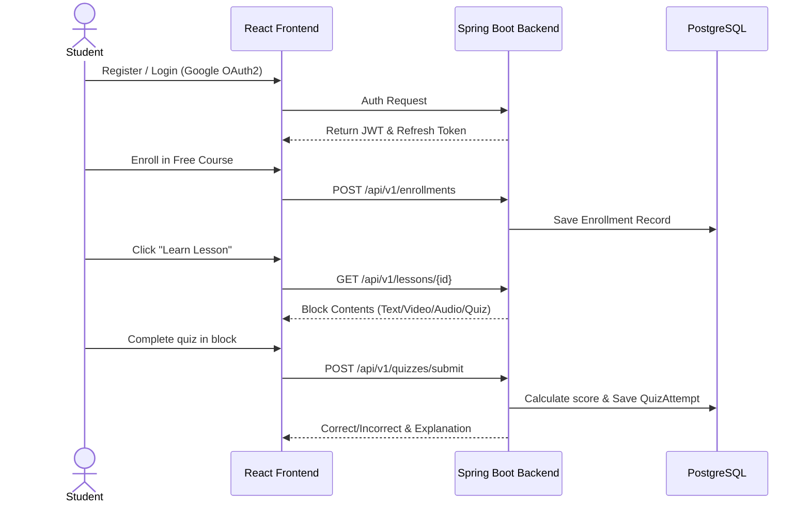
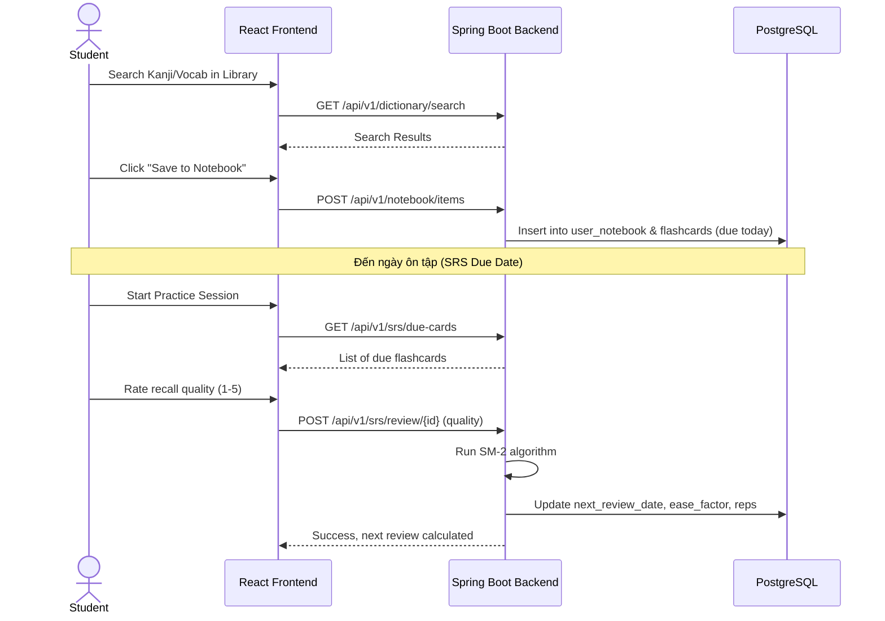
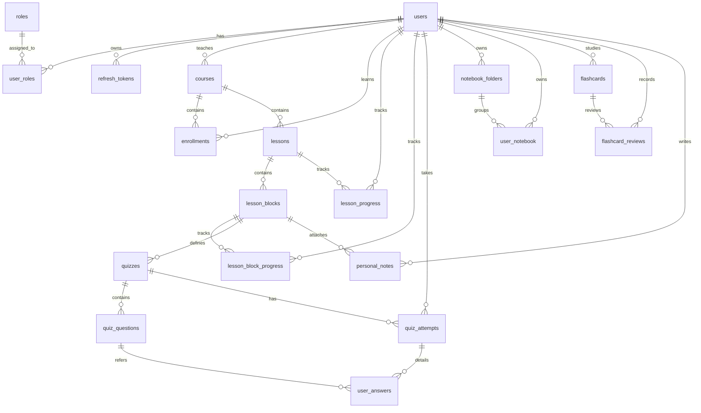

# 🌸 SAKURALEARN — TÀI LIỆU CHUYÊN SÂU PHỎNG VẤN INTERN BrSE TECH

Tài liệu này được biên soạn đặc biệt để chuẩn bị cho buổi phỏng vấn vị trí **Intern BrSE Tech** của dự án **SakuraLearn** (Nền tảng học tiếng Nhật JLPT N5–N1 tích hợp AI cho người Việt).

---

## 📋 MỤC LỤC
1. [Tổng Quan Hệ Thống & Tech Stack Thực Tế](#1-tổng-quan-hệ-thống--tech-stack-thực-tế)
2. [Requirement Analysis (Phân Tích Yêu Cầu Chuyên Sâu)](#2-requirement-analysis-phân-tích-yêu-cầu-chuyên-sâu)
3. [User Stories & Quy Trình Nghiệp Vụ (User Journey)](#3-user-stories--quy-trình-nghiệp-vụ-user-journey)
4. [Database Design & ERD (Thiết Kế Cơ Sở Dữ Liệu)](#4-database-design--erd-thiết-kế-cơ-sở-dữ-liệu)
5. [API Design (Thiết Kế Hệ Thống API)](#5-api-design-thiết-kế-hệ-thống-api)
6. [AI Integration & Prompt Engineering (Tích Hợp Trí Tuệ Nhân Tạo)](#6-ai-integration--prompt-engineering-tích-hợp-trí-tuệ-nhân-tạo)
7. [Mẫu Câu Trả Lời Phỏng Vấn (Tiếng Việt & Tiếng Nhật)](#7-mẫu-câu-trả-lời-phỏng-vấn-tiếng-việt--tiếng-nhật)

---

## 1. Tổng Quan Hệ Thống & Tech Stack Thực Tế

SakuraLearn là một ứng dụng Web dạng **Monolith** kết hợp hệ thống Quản lý học tập (LMS), Thư viện tra cứu tiếng Nhật, Sổ tay thông minh và Ôn tập từ vựng ngắt quãng (SRS).

### Chi Tiết Tech Stack
*   **Frontend**: React 19, Vite 8, React Router 7, Axios (Quản lý call API thông qua Interceptor), `@dnd-kit` (Xử lý kéo thả bài giảng), **Custom CSS** (không dùng Tailwind).
*   **Backend**: Java 21, Spring Boot 4.0.5, Spring Security (Xác thực stateless JWT), JPA/Hibernate, MapStruct (DTO mapping), Lombok.
*   **Cơ sở dữ liệu**: PostgreSQL 16 sử dụng UUID làm khóa chính (PK). Quản lý migration bằng **Flyway (V1 đến V7)**.
*   **Lưu trữ & Email dịch vụ**: MinIO (Tương thích S3 cho thumbnail/media), Mailpit (SMTP server giả lập trong môi trường local).
*   **AI Engine**: Spring AI tích hợp Google Gemini API (model `gemini-pro`) và OpenAI làm fallback.

---

## 2. Requirement Analysis (Phân Tích Yêu Cầu Chuyên Sâu)

Với vai trò là một **BrSE**, việc làm rõ yêu cầu từ phía khách hàng (hoặc Product Owner) và chuyển hóa chúng thành các đặc tả kỹ thuật cho Dev Team là vô cùng quan trọng.

### 2.1 Đối Tượng Sử Dụng (Target Users)
1.  **STUDENT (Học viên)**: Người Việt muốn tự học tiếng Nhật từ N5 đến N1. Yêu cầu giao diện tiếng Việt rõ ràng, có công cụ ôn tập (Flashcard) và luyện nói trực tiếp với AI.
2.  **TEACHER (Giáo viên)**: Biên soạn khóa học, cấu trúc bài giảng dưới dạng kéo thả, soạn đề thi thử/quiz, quản lý tiến độ lớp học.
3.  **ADMIN (Quản trị viên)**: Phân quyền vai trò, quản lý bảo mật hệ thống, theo dõi Audit Logs hệ thống để phòng ngừa rủi ro phá hoại dữ liệu.

### 2.2 Phân Tích 9 Modules của Dự Án

Hệ thống được thiết kế chia làm 9 module để đảm bảo tính modularity (dễ mở rộng và bảo trì):

*   **M1 - Auth & User Management**: Đăng ký, đăng nhập JWT, xoay vòng token (Refresh Token Rotation), xác thực email qua mã token, đăng nhập SSO Google OAuth2.
*   **M2 - Course & Lesson Management**: Quản lý CRUD khóa học (hỗ trợ đa ngôn ngữ vi/ja/en), bài học (Lessons) và các khối nội dung (Lesson Blocks: TEXT, VIDEO, AUDIO, IMAGE, QUIZ, PRACTICE).
*   **M3 - Learning Experience & Progress**: Trình phát bài giảng, ghi chú cá nhân theo từng block bài học, lưu vị trí video/audio đang xem dở (resume timestamp), tự động tính toán % tiến trình khóa học.
*   **M4 - Knowledge Base (Dictionary)**: Tra cứu nhanh từ điển Kanji (~3000 từ), Từ vựng (~21,000 từ) và Ngữ pháp (~847 mẫu cấu trúc). Chuyển đổi Romaji sang Hiragana tự động khi tìm kiếm.
*   **M5 - Spaced Repetition System (SRS)**: Thuật toán SuperMemo-2 (SM-2) tự động tối ưu chu kỳ ôn tập từ vựng của học viên dựa trên đánh giá mức độ nhớ từ 1 đến 5.
*   **M7 - Administration & Analytics**: Thống kê doanh thu, người dùng, xem lịch sử thay đổi hệ thống qua Audit Logs.
*   **M9 - Notification**: Hệ thống gửi thông báo in-app.
*   **M6 (Payment/VNPay)** & **M8 (Gamification/Huy hiệu)**: *Đã thiết kế sẵn Database Schema ở Flyway migration V1, chưa cài đặt luồng xử lý code Java/React.*

---

## 3. User Stories & Quy Trình Nghiệp Vụ (User Journey)

### 3.1 Giai Đoạn 1: Đăng Ký - Học Tập - Làm Bài


### 3.2 Giai Đoạn 2: Lưu Sổ Tay & Ôn Tập SRS (SM-2)


### 3.3 User Stories Tiêu Biểu (BrSE format)

*   **US-Student-01**: *As a Student, I want to review vocabulary using flashcards with a quality rating of 1 to 5, so that the Spaced Repetition system can calculate the next review interval to optimize my memorization.*
    *   **Acceptance Criteria**:
        1. Giao diện hiển thị mặt trước (Từ vựng) -> bấm lật ra mặt sau (Cách đọc, nghĩa tiếng Việt, câu ví dụ).
        2. Cung cấp 5 nút đánh giá: 1 (Quên hoàn toàn) đến 5 (Nhớ hoàn hảo).
        3. Bấm đánh giá sẽ gọi API cập nhật dữ liệu SRS và ẩn thẻ bài tập đó khỏi danh sách ôn tập hôm nay.

*   **US-Teacher-01**: *As a Teacher, I want to create a course syllabus using drag-and-drop interface, so that I can easily reorder lessons and block contents without manual indexing.*
    *   **Acceptance Criteria**:
        1. Giáo viên có thể kéo thả để thay đổi vị trí của các Bài học (Lessons) và các Khối nội dung (Lesson Blocks).
        2. Vị trí mới (order_index) được lưu tự động xuống database khi người dùng kết thúc thao tác kéo thả.

---

## 4. Database Design & ERD (Thiết Kế Cơ Sở Dữ Liệu)

Dự án gồm **30 bảng dữ liệu** được quản lý chặt chẽ thông qua Flyway. Sử dụng kiểu dữ liệu **UUID** làm khóa chính cho tất cả các bảng thay vì tuần tự tự tăng (BIGSERIAL) để tăng tính bảo mật bảo vệ tài nguyên hệ thống trước các cuộc tấn công đoán ID (ID Enumeration attacks).

### 4.1 Thực Thể và Quan Hệ (Entity Relationships)



### 4.2 Các Bảng Dữ Liệu Quan Trọng (Schema chi tiết)

#### Bảng `users` (Thông tin người dùng)
*   `id` UUID PK Default `gen_random_uuid()`
*   `username` VARCHAR(50) UNIQUE NOT NULL
*   `email` VARCHAR(100) UNIQUE NOT NULL
*   `password_hash` VARCHAR(255) NOT NULL
*   `xp` BIGINT DEFAULT 0
*   `current_streak` INT DEFAULT 0
*   `preferred_language` VARCHAR(10) DEFAULT 'vi'
*   `srs_daily_limit` INT DEFAULT 80

#### Bảng `flashcards` (Dành cho ôn tập từ vựng SRS)
*   `id` UUID PK
*   `user_id` UUID FK -> `users(id)` ON DELETE CASCADE
*   `item_type` ENUM ('KANJI', 'VOCAB', 'GRAMMAR', 'CUSTOM') NOT NULL
*   `item_id` UUID NOT NULL (Tham chiếu động đến ID của bảng Kanji, Vocab, Grammar hoặc Custom item)
*   `due_date` TIMESTAMPTZ (Thời gian cần ôn tập tiếp theo)
*   `interval_days` INT DEFAULT 1 (Khoảng cách ngày giữa các lần ôn tập)
*   `ease_factor` DOUBLE PRECISION DEFAULT 2.5 (Hệ số dễ nhớ, dùng để nhân khoảng cách)
*   `reps` INT DEFAULT 0 (Số lần ôn tập liên tục thành công)
*   *Constraint*: UNIQUE (`user_id`, `item_type`, `item_id`)

#### Bảng `lesson_blocks` (Khối nội dung bài học)
*   `id` UUID PK
*   `lesson_id` UUID FK -> `lessons(id)` ON DELETE CASCADE
*   `block_type` VARCHAR(20) NOT NULL (TEXT, VIDEO, AUDIO, IMAGE, QUIZ, PRACTICE)
*   `order_index` INT NOT NULL
*   `metadata` JSONB (Lưu thông số cấu hình mềm như tỷ lệ hoàn thành video, file size, câu hỏi phụ...)

### 4.3 Những Thiết Kế Kỹ Thuật Độc Đáo trong Database

1.  **Kiểu JSONB trong PostgreSQL**: Dùng ở cột `metadata` của `lesson_blocks` và cột `options`, `correct_answer` của `quiz_questions`. Việc này giúp hệ thống lưu trữ được nhiều định dạng câu hỏi (chọn 1 đáp án, điền từ vào chỗ trống, nối từ, sắp xếp câu) mà không cần cấu trúc nhiều bảng con phức tạp làm chậm câu truy vấn SQL.
2.  **Chỉ mục GIN (Generalized Inverted Index)**: Cài đặt trên các cột mảng (onyomi, kunyomi, synonyms) của bảng từ vựng và bảng kanji giúp tăng tốc tìm kiếm từ khóa lên gấp hàng chục lần so với chỉ mục B-Tree thông thường khi tra cứu từ điển quy mô lớn.
3.  **Audit Logs tự động**: Cơ chế trigger trong database tự động lưu trạng thái trước (old_values) và sau (new_values) dưới dạng JSONB mỗi khi có tác vụ INSERT/UPDATE/DELETE giúp người quản trị dễ dàng phát hiện hành vi gian lận dữ liệu hệ thống.

---

## 5. API Design (Thiết Kế Hệ Thống API)

Hệ thống thiết kế theo chuẩn RESTful API, sử dụng tiền tố `/api/v1` và tổ chức nested resources (Tài nguyên lồng nhau) để biểu diễn mối quan hệ phụ thuộc.

### 5.1 Các Endpoints Tiêu Biểu

| Phương thức | URI Endpoint | Phân quyền truy cập | Mô tả |
| :--- | :--- | :--- | :--- |
| **POST** | `/api/v1/auth/login` | Public | Đăng nhập hệ thống, trả về access token JWT và Cookie refresh token |
| **GET** | `/api/v1/courses` | Public | Xem danh sách khóa học (hỗ trợ phân trang, lọc theo cấp độ JLPT, sắp xếp) |
| **POST** | `/api/v1/enrollments` | STUDENT | Đăng ký một khóa học |
| **GET** | `/api/v1/lessons/{id}` | STUDENT (phải có enrollment) | Lấy thông tin bài học và danh sách các blocks nội dung |
| **POST** | `/api/v1/lessons/{lessonId}/blocks/reorder` | TEACHER (phải là chủ khóa học) | Cập nhật vị trí các block sau khi kéo thả |
| **GET** | `/api/v1/srs/due-cards` | STUDENT | Lấy danh sách từ vựng đến hạn ôn tập hôm nay |
| **POST** | `/api/v1/srs/review/{id}` | STUDENT (chỉ chủ thẻ) | Nộp kết quả tự đánh giá thẻ từ vựng (chứa request body: `{"rating": 5}`) |
| **GET** | `/api/v1/admin/audit-logs` | ADMIN | Tra cứu nhật ký thay đổi dữ liệu hệ thống |

### 5.2 Luồng xử lý Security Token (JWT & Refresh Token Rotation)
Để tăng tính bảo mật, SakuraLearn sử dụng cơ chế **Refresh Token Rotation**:
1.  Access Token (JWT) có thời hạn ngắn (ví dụ: 15 phút), lưu trong bộ nhớ React.
2.  Refresh Token có thời hạn dài (ví dụ: 7 ngày), lưu trong database và gửi về client qua Cookie dạng `HttpOnly; Secure; SameSite=Strict` để chống tấn công XSS.
3.  Khi Access Token hết hạn, Axios Interceptor ở frontend bắt mã lỗi 401 và tự động gửi yêu cầu lên `/api/v1/auth/refresh` để nhận cặp Access/Refresh Token mới.
4.  Nếu Refresh Token cũ bị kẻ xấu đánh cắp và cố tình sử dụng lại, backend sẽ phát hiện token đã được dùng (revoked), lập tức hủy bỏ toàn bộ dòng Refresh Token liên quan đến user đó và bắt buộc đăng nhập lại để chống tấn công chiếm đoạt tài khoản.

---

## 6. AI Integration & Prompt Engineering (Tích Hợp Trí Tuệ Nhân Tạo)

SakuraLearn không dùng AI theo dạng Wrapper đơn giản mà tích hợp sâu thông qua thư viện **Spring AI** để hỗ trợ tạo giáo trình tự động và tạo bài tập luyện nói.

### 6.1 Tính năng AI Syllabus Generation (Tạo giáo trình tự động)
*   **Mô tả**: Giáo viên chỉ cần nhập tên khóa học (ví dụ: "Tiếng Nhật thương mại cơ bản") và mô tả ngắn, AI sẽ tự động phân tích và sinh ra cấu trúc các bài học và khối nội dung đề xuất.
*   **Kiến trúc xử lý lỗi (Multi-model Fallback)**:
    ```
    Yêu cầu tạo giáo trình từ UI
           │
           ▼
    [Spring AI: GPT-4o] ──(Thành công)──► Lưu DB và trả về React
           │
         (Lỗi / Timeout)
           │
           ▼
    [Spring AI: Gemini Pro] ──(Thành công)──► Lưu DB và trả về React
           │
         (Lỗi / API Key hết hạn)
           │
           ▼
    [Local Fallback Service] ──► Tạo giáo trình template có sẵn dưới Local DB
    ```

### 6.2 Prompt Engineering & Chat History (Luyện hội thoại với AI)
Tính năng Luyện hội thoại với AI tutor lưu lịch sử chat trực tiếp trong bảng `ai_chat_messages` để duy trì ngữ cảnh 10 câu thoại gần nhất giúp tiết kiệm chi phí gọi API và hạn chế token bị phình to.

#### Prompt thiết kế hệ thống (System Prompt) cho AI Chat:
```text
Role: You are a professional and friendly Japanese language tutor practicing conversation with a student.
Task:
1. Respond to the user's message in Japanese. Keep the sentence structures appropriate for JLPT level {jlptLevel}.
2. If the user makes grammatical or vocabulary mistakes in Japanese, gently highlight them in Vietnamese and provide the corrected version.
3. Use a mix of Japanese and simple Vietnamese explanations when introducing new vocabulary.
4. Keep the conversation engaging, encouraging, and ask one follow-up question at the end of each response.
History: {last_10_messages}
User Message: {user_message}
```

---

## 7. Mẫu Câu Trả Lời Phỏng Vấn (Tiếng Việt & Tiếng Nhật)

### 7.1 Câu hỏi về Sự khác biệt giữa Thiết kế DB và Hiện trạng thực tế dự án
> **Q: Em thấy hệ thống có bảng `payments` và `notifications`, nhưng code backend lại chưa cài đặt controller hay service cho phần này. Tại sao lại như vậy?**
>
> **Trả lời (Tiếng Việt)**:
> "Dạ đúng vậy ạ. Đây là quyết định thiết kế từ giai đoạn Requirement Analysis của nhóm. Trong Phase 1, chúng tôi ưu tiên hoàn thiện các luồng nghiệp vụ cốt lõi (P0) là M1 đến M5 bao gồm đăng ký, học tập bài giảng và hệ thống thẻ ôn tập SRS. Tuy nhiên, để đảm bảo tính mở rộng cao và không phải thực hiện các đợt migration cơ sở dữ liệu phức tạp sau này, chúng tôi đã chủ động thiết kế toàn bộ schema cho hệ thống thanh toán (Payment) và tích lũy điểm thưởng (Gamification) ngay từ Flyway Migration V1. Nhờ vậy, khi sang Phase 2 cài đặt cổng thanh toán VNPay, lập trình viên backend chỉ cần viết thêm code ứng dụng mà không cần thay đổi cấu trúc bảng đang chạy."
>
> **Trả lời (Tiếng Nhật)**:
> 「はい, その通りです。これは要件定義フェーズでの設計の決定です。フェーズ1では、認証、学習機能、SRS復習システムなど、コア機能であるM1からM5の実装を優先しました。ただし、将来の拡張性を確保し、データベースの移行（マイグレーション）を容易にするために、支払いやゲーム化のデータベース設計は、最初のFlyway Migration V1で事前に定義しておきました。これにより、フェーズ2で決済サービスを追加する際、既存のデータ構造を変更することなくスムーズに開発を進めることができます。」

---

### 7.2 Câu hỏi về Thuật toán ôn tập ngắt quãng Spaced Repetition (SRS)
> **Q: Em có thể giải thích chi tiết về thuật toán SRS sử dụng trong dự án được không?**
>
> **Trả lời (Tiếng Việt)**:
> "Hệ thống SRS của chúng tôi phát triển dựa trên thuật toán SuperMemo-2 (SM-2). Thuật toán này tự động tính toán thời điểm ôn tập tối ưu tiếp theo cho từ vựng dựa trên mức độ tự đánh giá (chất lượng câu trả lời - Quality từ 1 đến 5) của người học.
> - Nếu người học nhớ từ tốt (Quality >= 3), khoảng thời gian ôn tập tiếp theo (Interval) sẽ được nhân lên với Hệ số dễ nhớ (Ease Factor, mặc định ban đầu là 2.5). Số lần ôn tập thành công liên tục (Reps) sẽ tăng lên 1.
> - Nếu người học quên từ (Quality < 3), số lần lặp Reps sẽ bị reset về 0, khoảng thời gian ôn tập đưa về 1 ngày để học viên ôn tập lại ngay ngày hôm sau.
> - Hệ số Ease Factor cũng được tính toán lại sau mỗi lần dựa trên công thức cập nhật của SM-2 nhằm đảm bảo từ vựng khó sẽ xuất hiện thường xuyên hơn, còn từ vựng dễ sẽ thưa dần đi, giúp tối ưu thời gian học."

---

### 7.3 Câu hỏi về vai trò BrSE kết nối kỹ thuật
> **Q: Là một BrSE, em sẽ làm gì nếu Dev phản ánh rằng đặc tả yêu cầu của khách hàng Nhật Bản không khả thi hoặc làm tăng chi phí dự án?**
>
> **Trả lời (Tiếng Việt)**:
> "Khi xảy ra trường hợp này, trước hết em sẽ tổ chức một buổi họp kỹ thuật nội bộ với các Tech Lead của đội phát triển để hiểu rõ nguyên nhân tại sao yêu cầu đó không khả thi (do giới hạn công nghệ, cấu trúc dữ liệu hiện tại hay do thời gian quá ngắn). Sau đó, em sẽ đề xuất cùng đội ngũ dev đưa ra 1-2 phương án thay thế (Alternative Solutions) vẫn giải quyết được bài toán nghiệp vụ của khách hàng nhưng có tính khả thi cao hơn hoặc tốn ít nhân lực hơn. Cuối cùng, em sẽ chuẩn bị tài liệu so sánh rõ ưu nhược điểm của các phương án (bằng tiếng Nhật) để đàm phán với khách hàng, giúp họ hiểu rõ rủi ro và cùng đưa ra quyết định phù hợp nhất cho dự án."
>
> **Trả lời (Tiếng Nhật)**:
> 「このような場合、まず開発チームのテックリードと内部会議を行い、技術的な制限、データ構造、または開発スケジュールの観点から、なぜその要件が難しいのかを正確に把握します。次に、開発チームと協力して、顧客のビジネス課題を解決しつつ、実現可能性が高くコストを抑えられる代替案を1〜2つ作成します。最後に、それぞれの提案のメリットとデメリットを比較した資料を日本語で用意し、クライアントと交渉します。技術的なリスクを論理的に説明し、プロジェクトにとって最適な合意形成を目指します。」

---
*Chúc bạn có một buổi phỏng vấn thành công tốt đẹp! 🌸*
