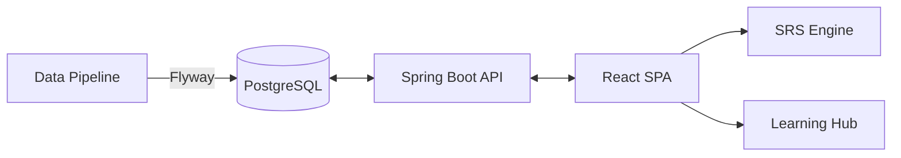

# 🌸 SakuraLearn: The Ultimate Japanese Learning Ecosystem

  
  
  
  

---

## 📖 Giới thiệu
**SakuraLearn** không chỉ là một ứng dụng học ngôn ngữ, mà là một **Hệ sinh thái Quản lý Tri thức Nhật ngữ** toàn diện. Được thiết kế dành riêng cho người học Việt Nam, ứng dụng kết hợp sức mạnh của thuật toán SRS hiện đại, kho dữ liệu khổng lồ và trải nghiệm người dùng tinh tế (Glassmorphism UI).

## 🚀 Trạng thái dự án (Module Roadmap)

Hệ thống được phát triển theo lộ trình 8 Module chuyên sâu:

- [x] **Module 1: Authentication & Identity** (JWT, RBAC, Social Login Ready)
- [x] **Module 2: Course & Syllabus Management** (Hệ thống quản lý bài học đa tầng)
- [x] **Module 3: Premium Learning Experience** (Video Player, Quiz, Real-time Progress)
- [x] **Module 4: Knowledge Graph (Dictionary)** (Kanji, Vocab, Grammar Data - 300k+ records)
- [ ] **Module 5: Adaptive SRS (Review)** (Thuật toán lặp lại ngắt quãng SM-2/FSRS)
- [ ] **Module 6: Monetization (VNPay)** (Cổng thanh toán & Mở khóa nội dung)
- [ ] **Module 7: Administration & Insights** (Báo cáo thống kê & Audit Log)
- [ ] **Module 8: Gamification (Retention)** (Hệ thống Streak, XP và Huy hiệu)

## 🛠 Tech Stack "State-of-the-art"

### Backend (The Brain)
- **Framework:** Java 17, Spring Boot 3.2, Spring Security (JWT).
- **Persistence:** Spring Data JPA, Hibernate.
- **Migration:** Flyway (Versioned SQL migrations).
- **Security:** CSRF protection, Token Rotation, Audit Tracking.

### Frontend (The Beauty)
- **Core:** React 19 (Stable), Vite, React Router 7.
- **Styling:** Custom Design System (Vanilla CSS), Glassmorphism, Responsive Mobile-first.
- **Interactions:** Lucide Icons, Canvas Confetti, DND-Kit.

## 🏗 Kiến trúc dữ liệu & Hệ thống

## 💎 Điểm nhấn Kỹ thuật (Engineering Excellence)
*   **Audit Logging:** Theo dõi mọi thay đổi dữ liệu (`old_values` vs `new_values`).
*   **Soft Delete:** Bảo vệ dữ liệu người dùng, cho phép khôi phục khi cần thiết.
*   **Data Seeding:** Quy trình ETL tự động nạp dữ liệu từ Kanjidic2 & JMDict vào PostgreSQL.
*   **Motivational UX:** Hệ thống tin nhắn khích lệ và hiệu ứng ăn mừng ngay khi hoàn thành bài học.

## 🏁 Khởi chạy dự án

1.  **Yêu cầu:** Docker, JDK 17, Node.js 18+.
2.  **Cơ sở dữ liệu:** `docker-compose up -d`.
3.  **Backend:** `cd sakuralearn-backend && mvn spring-boot:run`.
4.  **Frontend:** `cd sakuralearn-frontend && npm install && npm run dev`.

---
*Developed by SakuraLearn Team.*
