# SakuraLearn

SakuraLearn is a Japanese learning platform for Vietnamese learners, combining a role-based LMS, a Japanese knowledge base, personal notebook, quiz flow, and spaced repetition review.

The project is organized as a full-stack application:

- Frontend: React 19, Vite, React Router, Axios, **@dnd-kit (Drag & Drop)**, custom CSS.
- Backend: Java 21, Spring Boot 4, Spring Security, JWT, Spring Data JPA, Flyway, **Spring AI (OpenAI & Gemini)**.
- Database: PostgreSQL 16 with versioned SQL migrations and large dictionary seed data.
- Infrastructure: Docker Compose for PostgreSQL, Redis, Mailpit, MinIO, and Kafka.

## 🚀 Technical Highlights

- **🤖 AI-Powered Content:** Integrated with **Spring AI** to automate the generation of educational content and syllabus structures using LLMs (OpenAI/Gemini).
- **🧠 Intelligent Learning (SRS):** Implementation of the **SM-2 algorithm** for personal vocabulary notebooks, calculating optimal review intervals based on user performance.
- **🛡️ Enterprise Features:** Built-in **Audit Log service** for system-wide change tracking and robust **Role-Based Access Control (RBAC)**.
- **📈 Sophisticated Data Pipeline:** A comprehensive Node.js ETL suite (20+ scripts) for consolidating, cleaning, and rebalancing JLPT dictionary data from raw sources.


## Current Status

The codebase currently includes the core implementation for:

- Authentication and identity: email/password registration, email verification, login, refresh token, logout, forgot/reset password, OAuth2 Google hooks, RBAC.
- Course and lesson management: course CRUD, lesson CRUD, lesson block CRUD, syllabus management, course publishing.
- Learning experience: learning view, lesson progress, block progress, quiz block, personal notes.
- Dictionary and notebook: Kanji, vocabulary, grammar browsing/search, library overview, personal notebook folders, saved items.
- SRS review: flashcard creation from notebook items, due-card listing, SM-2 style review scheduling.
- Administration: user management, role/status updates, dashboard statistics, audit log service.

Some modules are represented in database schema and documentation but are still partial at application level:

- Payment and monetization.
- Notification workflows.
- Full gamification workflows.
- Production-grade analytics and reporting.

---

## 💡 Engineering Deep Dives (Core Highlights)

Each module was designed with production-grade challenges in mind. Here are the highlights of the engineering decisions I'm most proud of:

### 🔐 Module 1: Identity & Security Backbone
*   **Self-Healing Sessions:** Frontend (`api.js`) implements **Axios Interceptors** to detect `401 Unauthorized` errors and automatically execute a silent **Refresh Token Rotation**. This ensures a seamless UX without manual re-logins.
*   **Non-Blocking Audit:** The **Audit Log Service** uses Spring's **`@Async`** processing to track system-wide changes (roles, status, logins) without adding latency to the main API response time.
*   **Security Context:** Implements a strict **Stateless JWT** architecture with secure storage strategies discussed in the [Security Review](docs/PROJECT_REVIEW_ISSUES_AND_RECOMMENDATIONS_VN.md).

### 📚 Module 2: AI-Driven CMS & Media Orchestration
*   **Multi-Model AI Fallback:** The **Syllabus Generator** (`AiSyllabusServiceImpl`) is built to iterate through **GPT-4o, Gemini Pro, and Grok**. If all APIs fail, it gracefully falls back to a **Smart Local Template** to ensure zero downtime for teachers.
*   **Polymorphic Content:** Uses **JSONB** metadata for `LessonBlock` entities, allowing for infinite flexibility in content types (Video, Quiz, Text, Audio) without expensive database schema migrations.
*   **Object Storage:** Direct integration with **MinIO (S3)** using presigned URLs to serve large media assets securely and efficiently.

### 📊 Module 3: Hierarchical Progress Engine
*   **Granular Precision:** Progress is not just a flat percentage; it's a **derived state** calculated from `LessonBlockProgress` → `LessonProgress` → `Enrollment`. 
*   **Resume State Logic:** Captures and persists the `lastTimestamp` for interactive blocks, enabling students to pick up exactly where they left off across different devices.
*   **Data Consistency:** Includes a **Recalculation Engine** that updates all student progress records automatically if a teacher modifies the course structure, ensuring 100% data accuracy.

### 🏮 Module 4: 300k+ Record Knowledge Graph
*   **Query Optimization:** Uses **`@EntityGraph`** and optimized **JOIN** strategies in `KanjiRepository` to solve the N+1 problem, loading complex Kanji-Radical relationships in a single database round-trip.
*   **Linguistic Search UX:** Implements a **Global Search** engine with real-time **Romaji-to-Hiragana conversion** and GIN index-backed Full-Text Search, delivering results for beginners and advanced users in under 500ms.

### 🧠 Module 5: Science-Backed SRS (Spaced Repetition)
*   **Algorithm Integrity:** Custom implementation of the **SuperMemo-2 (SM-2)** logic. It dynamically recalibrates the **Ease Factor** and **Intervals** for every card review within a single ACID transaction.
*   **Ease-Factor Protection:** Includes a **Min-EF Floor (1.3)** to prevent "Ease Hell"—a common SRS pitfall where cards appear too frequently and overwhelm the learner.
*   **Automatic Synchronization:** Deeply integrated with the Dictionary; adding any item to a personal **Notebook** automatically triggers the creation of a corresponding SRS flashcard.


## Repository Structure

```text
.
├── sakuralearn-frontend/        # React + Vite single-page application
├── sakuralearn-backend/         # Spring Boot REST API
├── database/                    # Standalone SQL schema reference
├── data/scripts/                # Advanced ETL pipeline (20+ scripts for dictionary processing)
├── docs/                        # Product specs, module notes, engineering docs
├── diagram/                     # Database/architecture diagrams
├── docker-compose.yml           # Local infrastructure
├── QUICK_START.md               # Short local commands
└── README.md                    # Project overview
```

## Architecture

```mermaid
flowchart LR
    FE[React SPA] --> API[Spring Boot REST API]
    API --> DB[(PostgreSQL)]
    API --> REDIS[(Redis)]
    API --> MINIO[(MinIO Object Storage)]
    API --> MAIL[Mailpit SMTP]
    API --> KAFKA[(Kafka)]
    DATA[Data Scripts] --> FLYWAY[Flyway Migrations]
    FLYWAY --> DB
```



## Main Backend Modules

| Area | Package |
| --- | --- |
| REST controllers | `controller` |
| Business services | `service`, `service.impl` |
| Persistence | `repository`, `entity` |
| API contracts | `dto.request`, `dto.response` |
| Mapping | `mapper` |
| Security | `security`, `security.oauth2` |
| Configuration | `config` |
| Error handling | `exception` |

Important API groups:

- `/api/v1/auth/**`
- `/api/v1/users/**`
- `/api/v1/admin/**`
- `/api/v1/courses/**`
- `/api/v1/lessons/**`
- `/api/v1/quizzes/**`
- `/api/v1/progress/**`
- `/api/v1/dictionary/**`
- `/api/v1/notebook/**`
- `/api/v1/srs/**`
- `/api/v1/files/**`
- `/api/v1/media/**`

## Main Frontend Modules

| Area | Path |
| --- | --- |
| Route definitions | `src/routes` |
| Page-level views | `src/pages` |
| Layouts | `src/layouts` |
| Shared components | `src/components` |
| API wrappers | `src/services` |
| Auth state | `src/contexts/AuthContext.jsx` |
| Route constants | `src/constants/routes.js` |

Implemented user-facing areas include login/register, dashboard, profile, admin user management, courses, teacher course management, learning view, dictionary library, notebook, and practice session.

## Database

Flyway migrations live in:

```text
sakuralearn-backend/src/main/resources/db/migration
```

Current migration set:

- `V1__Initial_Database_Schema.sql`: core schema, roles, users, courses, lessons, dictionary tables, quiz tables, notebook, SRS, payment/notification/gamification-ready tables.
- `V2__Seed_Radicals.sql`: radical seed data.
- `V3__Seed_Kanji_Master.sql`: Kanji seed data.
- `V4__Seed_Vocab_Master.sql`: vocabulary seed data.
- `V5__Seed_Grammar_Master.sql`: grammar seed data.

The backend runs with `spring.jpa.hibernate.ddl-auto=validate`, so schema changes should be made through Flyway migrations instead of Hibernate auto-update.

## Local Development

### Prerequisites

- Docker Desktop
- Java 21
- Node.js 20 or newer
- Git

### 1. Start Infrastructure

```powershell
docker compose up -d
```

Services:

| Service | URL/Port |
| --- | --- |
| PostgreSQL | `localhost:5433` |
| Redis | `localhost:6379` |
| Mailpit SMTP | `localhost:1025` |
| Mailpit UI | `http://localhost:8025` |
| MinIO API | `http://localhost:9000` |
| MinIO Console | `http://localhost:9001` |
| Kafka | `localhost:9092` |

### 2. Run Backend

```powershell
cd sakuralearn-backend
.\mvnw.cmd spring-boot:run
```

Backend defaults:

- API base URL: `http://localhost:8080/api/v1`
- Swagger UI: `http://localhost:8080/swagger-ui.html`
- OpenAPI JSON: `http://localhost:8080/v3/api-docs`

### 3. Run Frontend

```powershell
cd sakuralearn-frontend
npm install
npm run dev
```

Frontend defaults:

- App URL: `http://localhost:3000`
- API base URL: `VITE_API_BASE_URL` or `http://localhost:8080/api/v1`

### 4. Development Login

The local seeder creates a default admin account if it does not exist:

```text
Email: admin@sakuralearn.com
Password: admin123
```

Use this only in local development. Change or remove the seeder before production use.

## Verification

The following checks were run successfully with Docker infrastructure active:

```powershell
cd sakuralearn-frontend
npm.cmd run build
```

```powershell
cd sakuralearn-backend
cmd /c mvnw.cmd test
```

Latest local result:

- Frontend production build: passed.
- Backend Spring context and focused service tests: passed.
- Backend test summary: `Tests run: 12, Failures: 0, Errors: 0, Skipped: 0`.

Current Phase 1 P0 truth map:

- See `docs/PHASE_1_P0_STATUS.md`.
- Module 1-5 are the current MVP release core.
- Module 6 and Module 8 should be treated as planned/partial until payment, notification, and full gamification workflows are implemented in code.

## CI

GitHub Actions workflows:

- `.github/workflows/frontend-ci.yml`: installs dependencies and runs Vite build.
- `.github/workflows/backend-ci.yml`: starts PostgreSQL/Redis services and runs Maven package.

## Configuration Notes

Current development configuration is optimized for local work. Before production deployment:

- Move database, MinIO, OAuth, JWT, AI, and mail secrets fully to environment variables or a secret manager.
- Replace default Docker passwords.
- Remove or rotate the default admin account.
- Disable Swagger/OpenAPI public access if not needed.
- Add production CORS origins.
- Add a test profile so backend tests do not depend on a developer's local database.
- Review token storage strategy on the frontend.

## Useful Commands

```powershell
# Show running containers
docker ps

# View infrastructure logs
docker compose logs -f

# Reset local infrastructure data
docker compose down -v
docker compose up -d

# Build frontend
cd sakuralearn-frontend
npm.cmd run build

# Test backend
cd sakuralearn-backend
cmd /c mvnw.cmd test
```

## Roadmap

Near-term engineering improvements:

- Add dedicated `dev`, `test`, and `prod` Spring profiles.
- Replace hardcoded local secrets with environment-driven config.
- Improve automated test coverage for auth, course management, dictionary search, notebook, and SRS.
- Add request/response validation tests for public API contracts.
- Finish payment, notification, analytics, and gamification workflows.
- Clean up debug logging and normalize documentation encoding.

