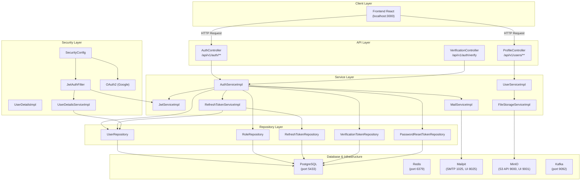
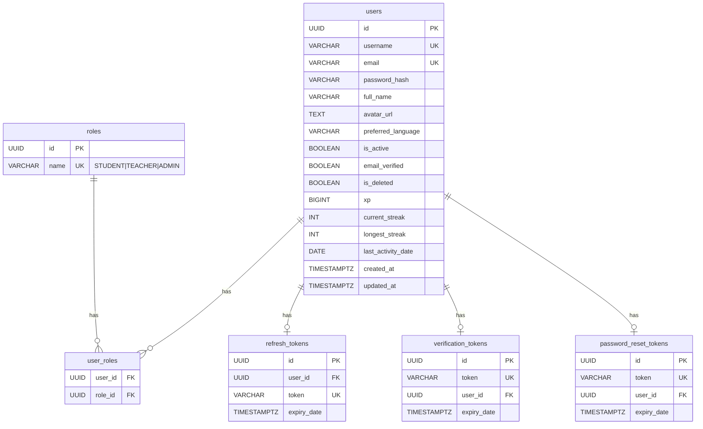
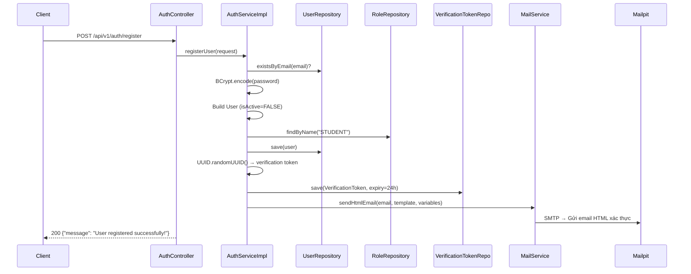
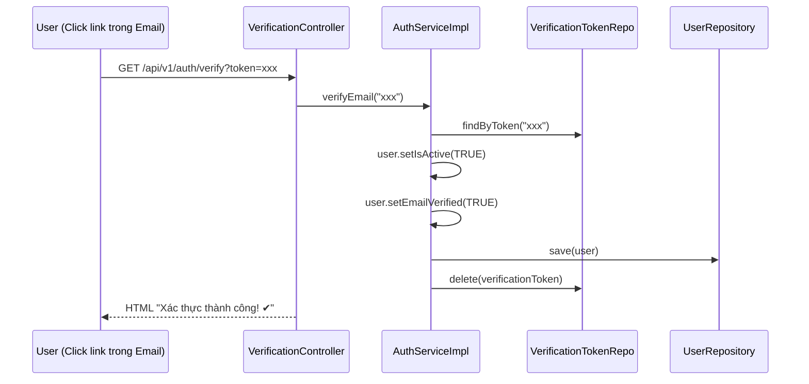
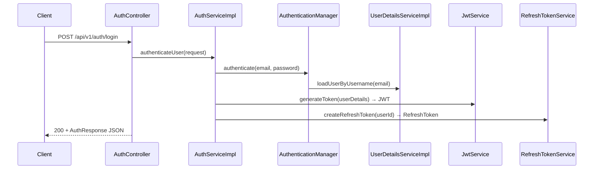
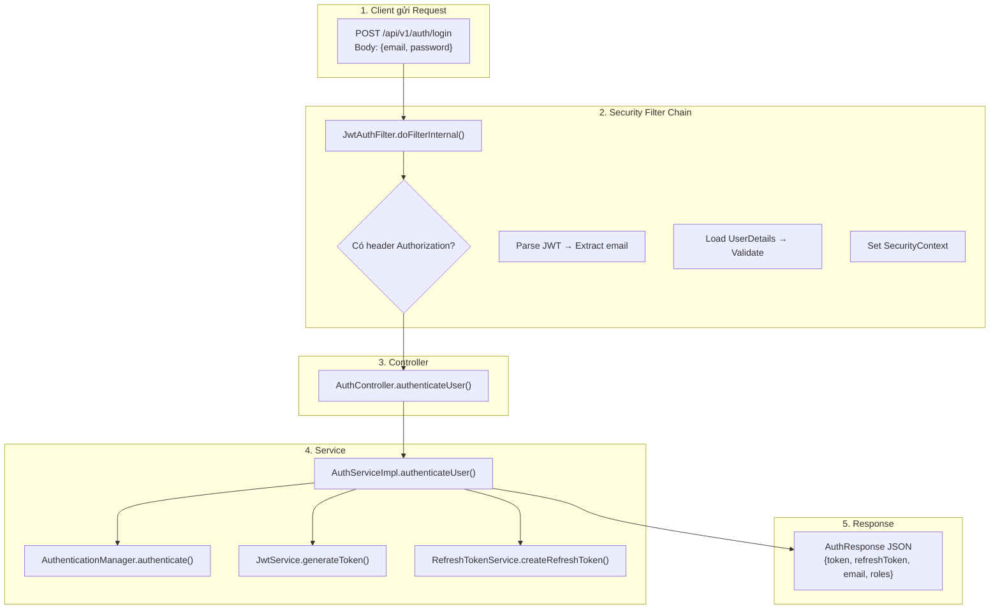

# 🌸 SakuraLearn Backend — Module 1: Authentication & User Management
## Phân tích TOÀN BỘ Logic Backend — Hướng dẫn tường tận

---

## 1. Tổng quan kiến trúc (Architecture Overview)



> [!IMPORTANT]
> Project tuân theo kiến trúc **Layered Architecture** chuẩn doanh nghiệp:
> `Controller → Service (Interface + Impl) → Repository → Database`

---

## 2. Infrastructure — Docker Compose

Toàn bộ hạ tầng chạy qua `docker-compose.yml`:

| Service | Image | Port | Vai trò |
|---------|-------|------|---------|
| **PostgreSQL** | `postgres:16-alpine` | `5433:5432` | Database chính |
| **Redis** | `redis:7-alpine` | `6379` | Cache (chưa sử dụng trực tiếp trong M1) |
| **Mailpit** | `axllent/mailpit` | `1025` SMTP, `8025` Web | Mail server dev (xem email verification) |
| **MinIO** | `minio/minio` | `9000` API, `9001` UI | Object Storage (avatar upload) |
| **Kafka** | `confluentinc/cp-kafka:7.6.0` | `9092` | Message Queue (chuẩn bị cho modules sau) |

---

## 3. Database Schema — Module 1

### Flyway Migrations

Quản lý bằng **Flyway**:

| Migration | Mô tả |
|-----------|-------|
| V1.0 | Tạo toàn bộ schema, ENUM types, indexes, triggers, seed roles |
| V1.1 | Tạo bảng `refresh_tokens` |
| V1.2 | Tạo bảng `verification_tokens` |
| V1.3 | Tạo bảng `password_reset_tokens` |

### ERD Module 1



---

## 4. Entity Layer — Mapping với DB

### 4.1 [User.java]
- Mapping bảng `users`.
- `roles`: ManyToMany với Role (EAGER fetch).
- `isActive`: false cho tới khi verify email.

---

## 5. Security Layer — Bộ não bảo mật

### 5.1 [SecurityConfig.java] — Cấu hình trung tâm
- CSRF: disabled.
- Session: STATELESS.
- endpoint mở: `/api/v1/auth/**`, Swagger docs.
- Mọi endpoint khác: phải authenticated.

### 5.2 Luồng JwtAuthFilter

```mermaid
flowchart TD
    A["HTTP Request đến"] --> B{"Header có<br/>'Authorization: Bearer xxx'?"}
    B -->|Không| F["filterChain.doFilter()<br/>→ Cho qua (nếu public endpoint)"]
    B -->|Có| C["parseJwt() → Tách token"]
    C --> D["jwtService.extractUsername(token)"]
    D --> E{"username != null<br/>AND chưa authenticated?"}
    E -->|Không| F
    E -->|Có| G["userDetailsService.loadUserByUsername(email)"]
    G --> H{"jwtService.validateToken(token, userDetails)?"}
    H -->|Không (expired/invalid)| F
    H -->|Có| I["Tạo UsernamePasswordAuthenticationToken"]
    I --> J["SecurityContextHolder.setAuthentication()"]
    J --> F
```

---

## 6. Service Layer — Logic nghiệp vụ

### 📌 Feature 1: ĐĂNG KÝ (registerUser)



---

### 📌 Feature 2: XÁC THỰC EMAIL (verifyEmail)



---

### 📌 Feature 3: ĐĂNG NHẬP (authenticateUser)



---

## 7. Tổng kết — Request Flow toàn cảnh



---
> Hướng dẫn này được tạo tự động bởi Antigravity để phân tích Module 1.
