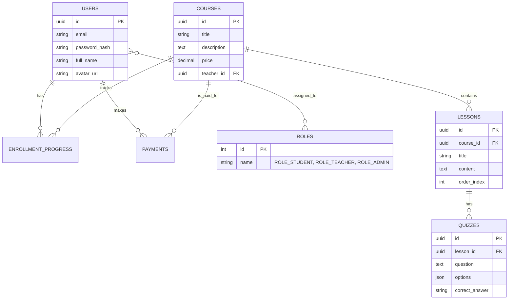

# SakuraLearn Documentation (BA & System Design)

Welcome to the documentation folder for SakuraLearn. 
Bên dưới là các tài liệu thiết kế và yêu cầu phần mềm song ngữ (EN/JP) dành cho dự án CMS học tiếng Nhật.

## System Architecture Overview
Dự án sử dụng kiến trúc Backend-heavy:
- **Backend:** Spring Boot 3.4, Java 21, Spring Security 6 (JWT), Redis, PostgreSQL, Kafka, WebSocket
- **Frontend:** React 18, Vite, Typecript
- **Infrastructure:** Docker, NGINX

## Quick Links
- [SRS (Software Requirements Specification)](SRS.md)
- [API Spec (TBD)](#)

## Core ERD (Draft)

